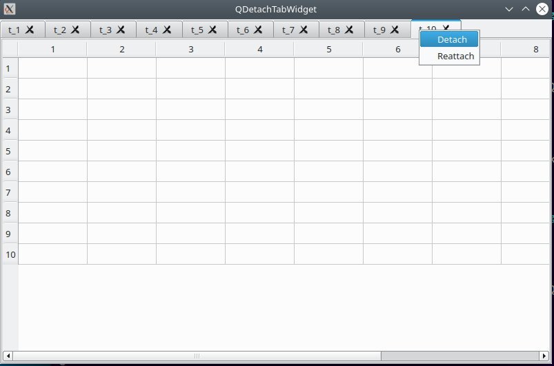

QDetachTabWidget
==================

QDetachTabWidget is an extenstion of QTabWidget to implement detachable tabs.

Double-click on any tab in the tab widget will bring up a small menu to detach the
tab into a separate window. The separated window can be resized and
moved anywhere on your screen. Note, it can not be closed using the window's menu bar.

In the QDetachTabWidget, a blank widget is put in the place of the detached widget.
QDetachTabWidget remembers the detached widget and the placeholder widget. If you
double-click the tab again, it will show the small menu again where
you can then reattach the widget.

This implemenation handles the cases of movable tabs and closeable tabs.

Copy QDetachTabWidget.h and QDetachTabWidget.cpp to your project.
Comes with a test program (main.cpp)

ScreenShot
==========

Building QDetachTabWidget
===========================

Download the latest code using 'clone'.

    % git clone https://github.com/epasveer/QDetachTabWidget

Setup cmake and build

    % cd QDetachTabWidget/src
    % cd build
    % cmake ..

    % make

Install it (or not), which will usually copy it to /usr/local/bin.
May need root access.

    % cd QDetachTabWidget/src/build
    % sudo make install

LICENSE
=======

QDetachTabWidget source code is licensed under the M.I.T. License.

